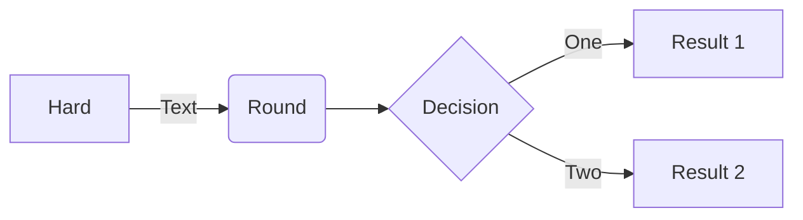
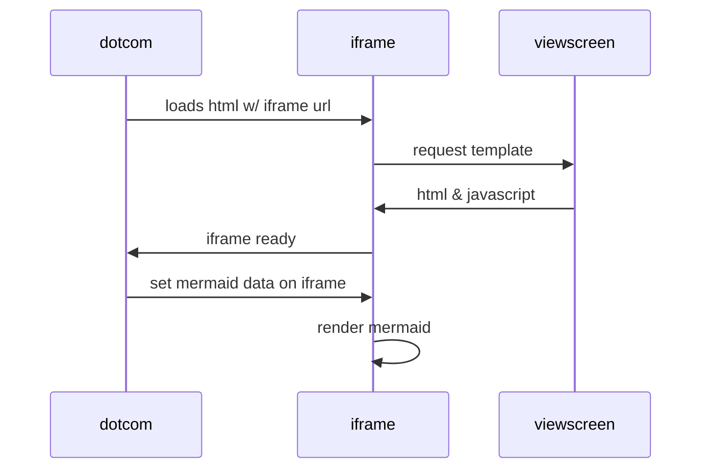
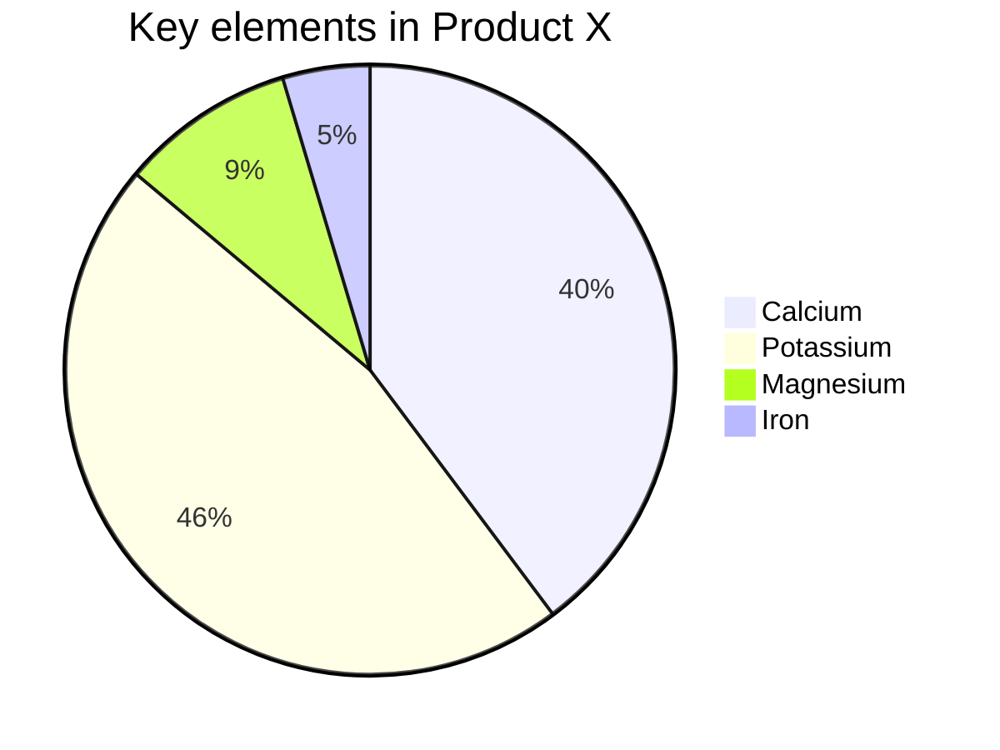
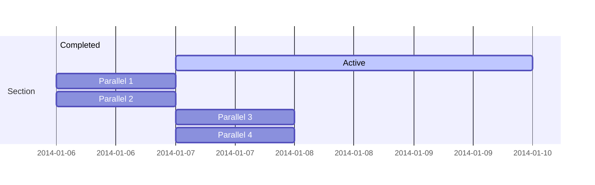
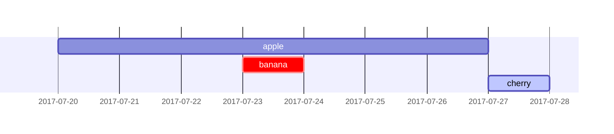

# mermaid
A repo to try out using mermaid diagrams

# Links
- [mermaid](https://mermaid-js.github.io/mermaid/#/)


# Examples

## Example TD Graph


## Example flowchart
- [Syntax](https://mermaid-js.github.io/mermaid/#/flowchart)


## Example Sequence Diagram
- [Syntax](https://mermaid-js.github.io/mermaid/#/sequenceDiagram)


## Pie chart
- [Syntax](https://mermaid-js.github.io/mermaid/#/pie)


## Example Gant
- [Syntax](https://mermaid-js.github.io/mermaid/#/gantt)


```mermaid
gantt
    axisFormat %A
    apple :a, 1w
    banana :crit, b, 23-7, 1d
    cherry :active, c, after b a, 1d
```

