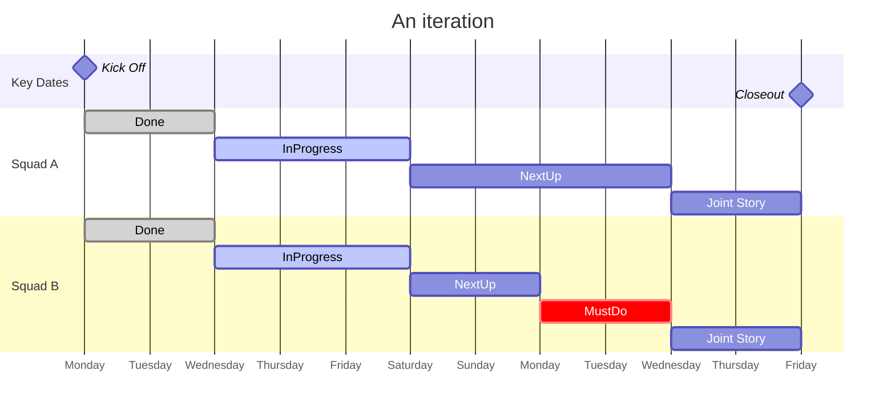

# Playground

Place to play with my own examples

## An iteration

```mermaid
gantt
    title An iteration
    axisFormat %A

    section Key Dates
    Kick Off  :milestone, ko, 2022-2-14,
    Closeout  :milestone, co, 2022-2-25,
  
    section Squad A
    Done: done, storya1, after ko, 2d
    InProgress: active, storya2, after storya1, 3d
    NextUp:     storya3, after storya2, 4d
    Joint Story:     storya4, after storya3, 2d

    section Squad B
    Done: done, storyb1, after ko, 2d
    InProgress: active, storyb2, after storyb1, 3d
    NextUp:     storyb3, after storyb2, 2d
    MustDo:     crit, storyb4, after storyb3, 2d
    Joint Story:     storyb4, after storya3, 2d
```